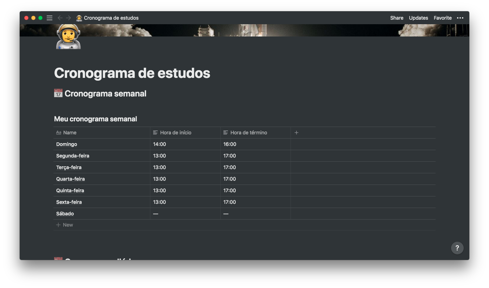
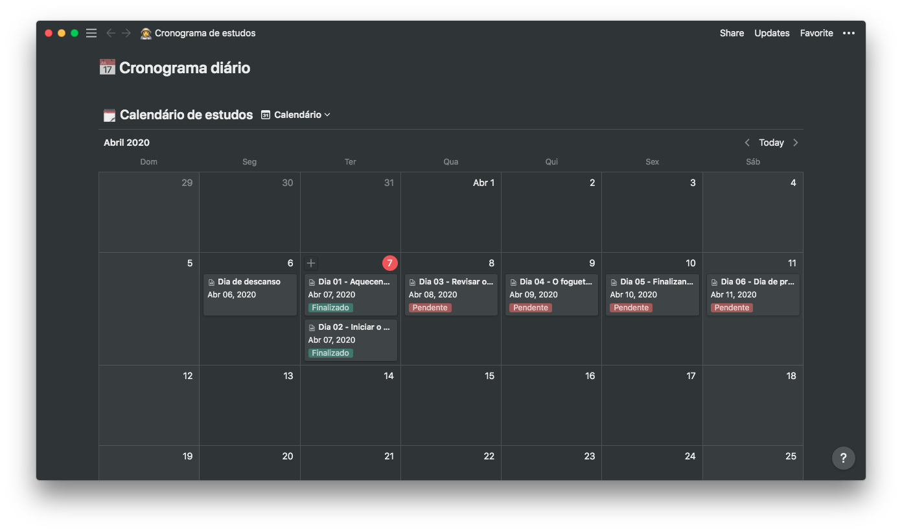

<h3 align="center">
  Desafio 1: Planejando meus estudos
</h3>

“Sua única limitação é você mesmo”!</blockquote>

  

  

  <a href="#rocket-sobre-o-desafio">Sobre o desafio</a>&nbsp;&nbsp;&nbsp;|&nbsp;&nbsp;&nbsp;
  <a href="#calendar-entrega">Entrega</a>&nbsp;&nbsp;&nbsp;|&nbsp;&nbsp;&nbsp;
  <a href="#memo-licença">Licença</a>

## :rocket: Sobre o desafio

Nesse desafio, foi feito os planejamentos do estudo semanal.

Criado um cronograma adaptado ao meu tempo e ritmo.

Definido horário de estudo, criado tarefas que estão a um calendário.

### Modelo de cronograma

Realizado o cronograma conforme o modelo disponibilizado pela rocketseat.

### Definindo o cronograma semanal

  

Nessa sessão foram informados os horários fixos que irei dedicar durante essa jornada como programador, afinal, a rotina de estudos será o primeiro passo para você conseguir atingir os seus objetivos o mais rápido possível!

### Definindo o cronograma diário

  

Planejado as tarefas diárias que irei consumir durante a semana.

Adicionado um post no meu 
<a href="https://www.linkedin.com/posts/gustavo-costa-3759a81a6_nodejs-reacjs-reactnaive-activity-6653270344343797760-vipa">
linkin</a>

## :calendar: Entrega

Esse desafio deve ser entregue a partir da plataforma Skylab. Após concluir o desafio, fazer um post no Linkedin sobre ele é uma boa forma de demonstrar seus esforços para evoluir na sua carreira para oportunidades futuras.

---

Feito com 💜 by Gustavo Costa